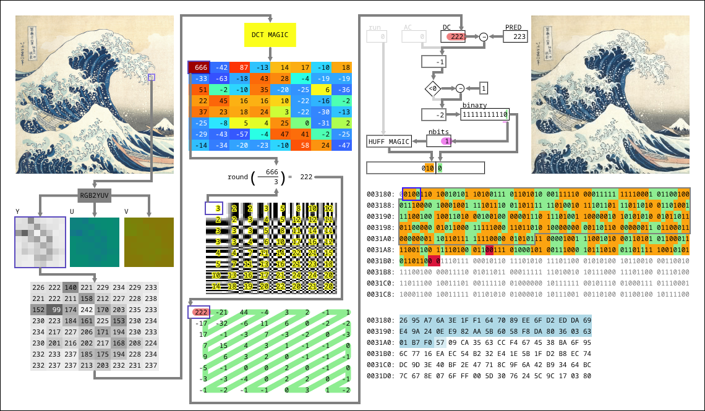

# `ascii.jpeg`: the plain-text jpeg generator

[`ASCII`](https://en.wikipedia.org/wiki/ASCII) is all about plain-text clarity.

[`JPEG`](https://ffglitch.org/docs/0.10.2/codecs/mjpeg/) is all about image compression.

`ascii.jpeg` is all about finding a compromise between `ASCII` and `JPEG` to create plain-text/image hybrid files.

## Quick link to the `ascii.jpeg` live demo

[https://jpeg.ffglitch.org/ascii](https://jpeg.ffglitch.org/ascii)

## Before I lose your attention, here's a colorful image generated with `ascii.jpeg`


The image above is the visual representation (scaled up to `512x512` pixels) of the `ASCII` plain-text data of the [`Lorem Ipsum`](https://en.wikipedia.org/wiki/Lorem_ipsum), interpreted as `JPEG`.

The original unscaled `JPEG` file is the small image below:


This is the hex dump of the contents of the original `JPEG` file:

```
00000000  ff d8 ff db 00 43 00 01  02 02 02 02 02 02 02 02  |.....C..........|
00000010  02 02 02 02 02 02 02 02  02 02 02 02 02 02 02 02  |................|
*
00000040  02 02 02 02 02 02 02 ff  c4 00 93 00 00 00 00 00  |................|
00000050  00 00 00 80 00 00 00 00  00 00 00 00 00 00 00 00  |................|
00000060  00 00 00 00 00 00 00 00  00 00 00 00 00 00 00 00  |................|
*
000000d0  00 00 00 00 00 00 00 00  00 00 00 00 ff c4 00 93  |................|
000000e0  10 00 00 00 00 00 00 00  80 00 00 00 00 00 00 00  |................|
000000f0  00 08 08 08 08 08 08 08  08 08 08 08 08 08 08 08  |................|
00000100  08 08 08 08 08 08 08 08  08 08 08 08 08 08 08 08  |................|
00000110  08 00 08 08 08 08 08 08  08 08 08 08 08 08 08 08  |................|
00000120  08 08 08 08 08 08 08 08  08 08 08 08 08 08 08 08  |................|
*
00000170  08 ff c0 00 11 08 00 20  00 20 03 01 22 00 02 11  |....... . .."...|
00000180  00 03 11 00 ff da 00 0c  03 01 00 02 00 03 00 00  |................|
00000190  3f 00 4c 6f 72 65 6d 20  69 70 73 75 6d 20 64 6f  |?.Lorem ipsum do|
000001a0  6c 6f 72 20 73 69 74 20  61 6d 65 74 2c 20 63 6f  |lor sit amet, co|
000001b0  6e 73 65 63 74 65 74 75  72 20 61 64 69 70 69 73  |nsectetur adipis|
000001c0  63 69 6e 67 20 65 6c 69  74 2c 20 73 65 64 20 64  |cing elit, sed d|
000001d0  6f 20 65 69 75 73 6d 6f  64 20 74 65 6d 70 6f 72  |o eiusmod tempor|
000001e0  20 69 6e 63 69 64 69 64  75 6e 74 20 75 74 20 6c  | incididunt ut l|
000001f0  61 62 6f 72 65 20 65 74  20 64 6f 6c 6f 72 65 20  |abore et dolore |
00000200  6d 61 67 6e 61 20 61 6c  69 71 75 61 2e 20 55 74  |magna aliqua. Ut|
00000210  20 65 6e 69 6d 20 61 64  20 6d 69 6e 69 6d 20 76  | enim ad minim v|
00000220  65 6e 69 61 6d 2c 20 71  75 69 73 20 6e 6f 73 74  |eniam, quis nost|
00000230  72 75 64 20 65 78 65 72  63 69 74 61 74 69 6f 6e  |rud exercitation|
00000240  20 75 6c 6c 61 6d 63 6f  20 6c 61 62 6f 72 69 73  | ullamco laboris|
00000250  20 6e 69 73 69 20 75 74  20 61 6c 69 71 75 69 70  | nisi ut aliquip|
00000260  20 65 78 20 65 61 20 63  6f 6d 6d 6f 64 6f 20 63  | ex ea commodo c|
00000270  6f 6e 73 65 71 75 61 74  2e 20 44 75 69 73 20 61  |onsequat. Duis a|
00000280  75 74 65 20 69 72 75 72  65 20 64 6f 6c 6f 72 20  |ute irure dolor |
00000290  69 6e 20 72 65 70 72 65  68 65 6e 64 65 72 69 74  |in reprehenderit|
000002a0  20 69 6e 20 76 6f 6c 75  70 74 61 74 65 20 76 65  | in voluptate ve|
000002b0  6c 69 74 20 65 73 73 65  20 63 69 6c 6c 75 6d 20  |lit esse cillum |
000002c0  64 6f 6c 6f 72 65 20 65  75 20 66 75 67 69 61 74  |dolore eu fugiat|
000002d0  20 6e 75 6c 6c 61 20 70  61 72 69 61 74 75 72 2e  | nulla pariatur.|
000002e0  20 45 78 63 65 70 74 65  75 72 20 73 69 6e 74 20  | Excepteur sint |
000002f0  6f 63 63 61 65 63 61 74  20 63 75 70 69 64 61 74  |occaecat cupidat|
00000300  61 74 20 6e 6f 6e 20 70  72 6f 69 64 65 6e 74 2c  |at non proident,|
00000310  20 73 75 6e 74 20 69 6e  20 63 75 6c 70 61 20 71  | sunt in culpa q|
00000320  75 69 20 6f 66 66 69 63  69 61 20 64 65 73 65 72  |ui officia deser|
00000330  75 6e 74 20 6d 6f 6c 6c  69 74 20 61 6e 69 6d 20  |unt mollit anim |
00000340  69 64 20 65 73 74 20 6c  61 62 6f 72 75 6d 2e ff  |id est laborum..|
00000350  d9                                                |.|
00000351
```

Notice that the file is split into three parts:
- The `JPEG` headers (first `0x192` bytes)
- Plain-text `ASCII` data of the `Lorem Ipsum`
- The `JPEG` End of Image marker (`0xffd9`)

But you can't just stuff `ASCII` data into any `JPEG` file.
You need some carefully-crafted `Huffman` tables in the headers of the `JPEG` file for that.

## JPEG

Very simplistically, a `JPEG` file is composed of some headers followed by a bunch of [`Huffman`](https://en.wikipedia.org/wiki/Huffman_coding)-encoded [`DCT`](https://en.wikipedia.org/wiki/Discrete_cosine_transform) coefficients.

Here's a quick visual overview of most steps of encoding a `JPEG` file:



This doesn't explain much nor does it make it any easier to understand the encoding of a `JPEG` file, but pay attention to the bits colored in orange/green in the center right of the image.

Each orange/green pair is a `Huffman` code followed by a `DCT` coefficient.
`Huffman` codes are [variable-length codes](https://en.wikipedia.org/wiki/Variable-length_code), meaning that they are encoded with a variable number of bits.

The `Huffman` codes specify two values:
- How many `DCT` coefficient to skip in the `zig-zag` (not important right now);
- How many bits the `DCT` coefficient immediately following it will have.

For example, we can see the codes:

| Huffman code (orange) | DCT coefficient (green) |
| ------ | ------ |
|    010 |      0 |
|  11010 |  01010 |
|  11010 |  10001 |
| 111000 | 101100 |
|    100 |    011 |
|    ... |    ... |

## ASCII

A plain-text `ASCII` file is just a long sequence of characters.

`ASCII` defines the binary encoding for 95 printable characters (and 33 control characters), and that's it.


`ASCII` codes are actually `7-bit`, but on a plain-text
For example, we have the following codes:


## Huffman table

The way huffman tables are defined in JPEG files (restricts) them a little bit.

We start with the code '0' .....

So we can't define all codes from '00000000' to '11111111'.

`ASCII` never starts with '1', so we can get that out of the way.

## Limitations in JPEG decoders

Sometimes, `ascii.jpeg` may generate non-compliant `JPEG` files.

But since most `JPEG` decoders are **very** robust, they will decode the file at least partially.

I will list here some limitations that I have noticed.

I have only tested `libjpeg-turbo` (used by `Chromium` and `Firefox`) and `FFmpeg`.

### Not enough data

Both `libjpeg-turbo` and `FFmpeg` will happily decode the image up to the last byte available in the stream and return a partially decoded file.

### Too much data

Both `libjpeg-turbo` and `FFmpeg` will happily decode the image up to the last coefficient necessary to complete the full image, and ignore the remaining data as garbage.

### EOF marker

While theoretically JPEG requires an `EOF` (End of Image) marker to determine where the file ends,
the vast majority of JPEG decoders will be fine if that marker is not present, or even if there is
a lot of garbage after the last decoded DCT coefficient.

`ascii.jpeg` does include an `EOF` marker at the end, but it probably doesn't need to.

### All-one Huffman codes

`JPEG` doesn't allow a Huffman code to be entirely composed of ones (e.g.: `11111111`).

`libjpeg-turbo` will fail to decode a file when such Huffman code is defined in the `DHT`.

`FFmpeg` will decode just fine.

### Zero run-length beyond the 64th coefficient

`JPEG` doesn't allow a block with more than 64 coefficients.
This may happen when the zero run-length goes beyond the 64th coefficient.

`FFmpeg` will stop decoding a file as soon as such violation is encountered.
The previous part of the image will have been decoded.

`libjpeg-turbo` will ignore the last coefficient (past index 64) and consider
the current block complete. It will continue decoding the image.

The same `JPEG` file above could be better compressed without `ASCII` data to the following data:

```
00000000  ff d8 ff db 00 43 00 01  02 02 02 02 02 02 02 02  |.....C..........|
00000010  02 02 02 02 02 02 02 02  02 02 02 02 02 02 02 02  |................|
*
00000040  02 02 02 02 02 02 02 ff  c0 00 11 08 00 20 00 20  |............. . |
00000050  03 01 22 00 02 11 00 03  11 00 ff c4 00 14 00 01  |..".............|
00000060  00 00 00 00 00 00 00 00  00 00 00 00 00 00 00 00  |................|
00000070  ff c4 00 15 10 01 01 00  00 00 00 00 00 00 00 00  |................|
00000080  00 00 00 00 00 08 00 ff  c4 00 14 01 01 00 00 00  |................|
00000090  00 00 00 00 00 00 00 00  00 00 00 00 00 ff c4 00  |................|
000000a0  15 11 01 01 00 00 00 00  00 00 00 00 00 00 00 00  |................|
000000b0  00 00 08 00 ff da 00 0c  03 01 00 02 11 03 11 00  |................|
000000c0  3f 00 1c 8d b0 e6 6d 86  c3 94 3a 43 28 b2 1b 8c  |?.....m...:C(...|
000000d0  a7 43 a1 ca 1a 4d 26 33  70 80 d8 74 10 19 44 06  |.C...M&3p..t..D.|
000000e0  f8 75 36 99 21 b4 de 20  37 1a 4d 27 53 a4 10 18  |.u6.!.. 7.M'S...|
000000f0  4d e6 58 20 37 9b cc b0  ce 61 86 93 a8 ba 08 0d  |M.X 7....a......|
00000100  c6 d8 20 34 9a 44 06 53  49 b4 40 75 39 c3 99 c8  |.. 4.D.SI.@u9...|
00000110  c9 0c a6 33 a1 d0 de 20  36 18 4c 62 03 09 bc d2  |...3... 6.Lb....|
00000120  20 34 9a 60 80 d8 71 34  88 0f 10 40 6f 36 99 04  | 4.`..q4...@o6..|
00000130  06 f3 99 c4 c2 2e 86 91  01 d4 cb 0e a6 58 6c 39  |.............Xl9|
00000140  41 01 94 e4 68 37 19 4d  22 03 74 36 1c 0c 26 5b  |A...h7.M".t6..&[|
00000150  ff d9                                             |..|
00000152
```
